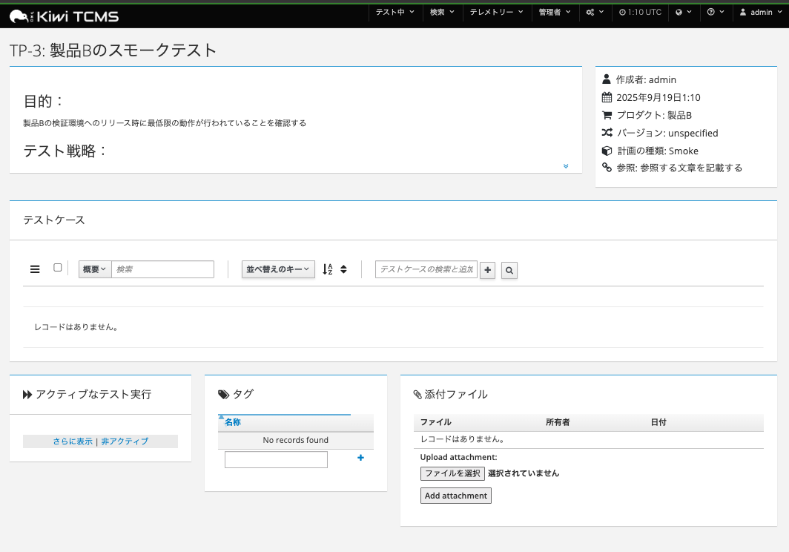
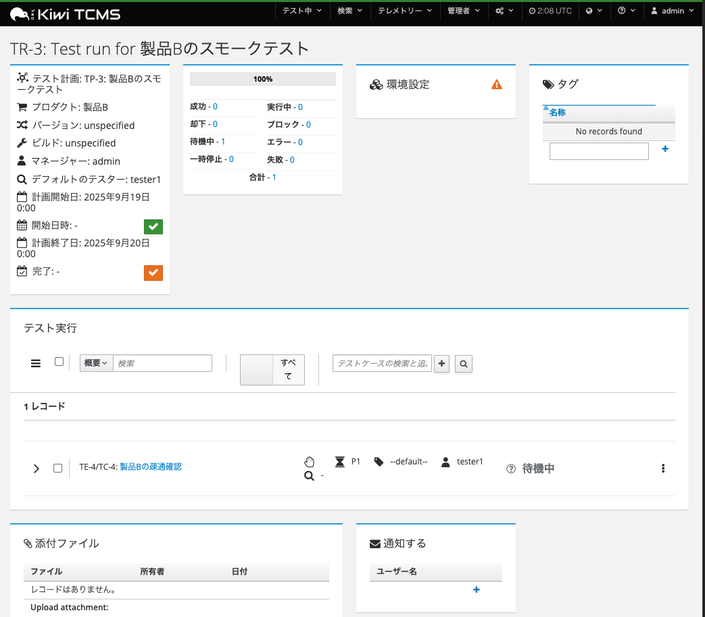

# Kiwi

ここではテストケース管理ツールのKiwiを実際に実験をします。

- [kiwitcms](https://kiwitcms.org/)
- [Document](https://kiwitcms.readthedocs.io/en/latest/index.html)
- [source](https://github.com/kiwitcms/Kiwi/tree/master)

## セットアップの方法

1. dockerコンテナを起動する

```bash
cd kiwi/docker
docker compose up -d
```

**注意1**:今回はテスト用にDBをsqliteにしています。本番運用する場合はMariaDBやPostgreSQLを設定してください。
SQLite で動作はしますが、本番運用は非推奨になっています。特にスキーマ変更を含むアップグレードで壊れやすいです。

**注意2**:今回はメールの送信を停止しています。コンテナ上のEMAIL_BACKEND環境変数でメール送信方法を制御可能です。

2. 初期スクリプトの実行

```bash
# 内部のバグ管理システムを有効化して初期化
docker compose exec kiwi_web_dev sh -lc 'cd /Kiwi && ./manage.py initial_setup'
# 実行中に以下を聞かれる
Username (leave blank to use '1001'): admin　# ユーザ名
Email address: admin@test.co.jp # メールアドレス
Password:  # パスワードを入力
Password (again): 
Bypass password validation and create user anyway? [y/N]: y　# 簡単なパスワードなどだときかれる
Superuser created successfully.
3. Setting the domain name:
Enter Kiwi TCMS domain: localhost # メールなどの通知につかうドメイン名
```

3. [https://localhost/](https://localhost/)にアクセスする。自己認証のため、警告がでるが無理やり遷移する。

**詳細設定**ボタンを押下する


「localhost にアクセスする（安全ではありません）」リンクを押下する


4. ログイン画面が表示されるのでユーザー名とパスワードを指定してログインする


5. トップ画面が表示される


## テスト実行までの操作

基本的なテスト実行までの流れは以下のとおり

- テスト計画を作成する
- テスト計画に紐づけるテストケースを作成する
- テスト計画中で紐づけられたテストケースを選択してテスト実行を作成する
- テスト実行上で各テストケースの実行結果を登録する

公式のチュートリアルは以下を参照  

https://kiwitcms.readthedocs.io/en/stable/tutorial.html

### ユーザー登録

まずは管理権限を持った管理者ユーザーでテストを実施するユーザーの登録を行う必要があります。
ここで登録したユーザーに対してテストの実行をアサインすることになります。

1. 画面上部のメニューの「管理者」から「ユーザー」を選択します。


2. 「ユーザ」画面に遷移したら「ユーザーを追加」ボタンを押下します。


3. 「ユーザーを追加」画面でユーザーでユーザー名とパスワードを入力して「保存して編集を続ける」を実行します。


4. ユーザの追加情報を入力できので権限を付与する


**スタッフ権限をあたえてTesterグループを選択**


なお、「保存して編集を続ける」と保存後にユーザーのフルネーム, email, 権限などの細かい設定をできます。
「保存してもう一つ追加」をすると新しいユーザーを続けて追加できます。

### 管理情報の追加

テスト計画などを書く前に、テスト対象となるプロダクトの情報を記述する必要があります。
この操作には管理権限が必要になります。

まず画面上部のメニューの「管理者」から「他のすべて」を選択します。


#### Classificationsの追加

Productsの分類を追加します。
類似した性質を持つ製品をグループ化するために使用されるタイトルです。
例：社内向け/A社向け/A事業用 etc。

1. 「Classifications」リンクを押下します。


2. 「classification を追加」ボタんを押下します。


3. Nameを入力後、「保存」ボタンを押下します。


#### Productsの追加

Productsはテスト対象となる製品情報です。
すべてのテスト計画、テストケースは特定のProductsに対して記述されます。

1. 「Products」リンクを押下します。


2. 「Products」の編集画面の「productを追加」を押下します。


3. Name, Classifications, Descriptionを入力して保存します。


なお、ID列の番号をクリックすることで、Productsの編集や削除が可能です


#### その他の管理用設定項目の概要

- Management
  - 「Components」の追加・変更・削除
    - Productsを構成する要素。(ex 認証機能、SSH連携機能 etc
    - テストケースに複数設定できる
  - 「タグ」の追加・変更・削除
    - テスト計画、テストケース, テスト実行に複数設定できるメタ情報
  - 「Versions」の追加・変更・削除
    - Productsのリリース単位情報
    - テスト計画に紐づける
  - 「ビルド」の追加・変更・削除
    - Versionのさらに細かい単位。
    - テスト計画、テスト実行に紐づける
- Testcases
  - 「Bug trackers」
    - 外部のバグトラッキングシステムと連携する場合に設定する
  - 「カテゴリ」の追加・変更・削除
    - テストケースの分類情報
    - 1つのテストケースに1つだけわりあてる

詳しくは以下を参照してください。
https://kiwitcms.readthedocs.io/en/latest/admin.html
 
### テスト計画の作成

テスト計画はテストの目標、およびそれらを達成するための手段とスケジュールの詳細な記述をするドキュメントです。
たとえば以下のような項目を記述します。

テスト計画は階層構造を作成することができ、別のテスト計画を親としたテスト計画を作成することができます。

1. 「テスト中」メニューから新しいテスト計画を選択する


2. 必要な項目を入力後、画面下部の「保存」ボタンを押す


3. テスト計画が作成される。必要に応じて「添付ファイル」やタグを追加する



画面上部の歯車ボタンより現在表示中のテスト計画の「編集」と「削除」が可能


### テストケースの追加

まずテストケースを追加するテスト計画を表示します。
もし、テスト計画登録後の画面を閉じてしまっているのであれば、画面上部の「検索」メニューから「テスト計画の検索」で検索が可能です。

1. テスト計画中のテストケースのメニューから「新しいテストケース」を選択する


2. 概要やテスト方法を入力して画面下部の保存ボタンを押す


**補足**：テンプレートを選択するとテストケースのテンプレートが表示されます。

3. テストケースが追加されるのを確認する


必要に応じて、テストケースに対して「タグ」や「コンポーネント」を付与することができます。

テストケースを編集、削除したい場合は画面上部の歯車ボタンのメニューから選択可能です。


### テスト実行

テストケースを作成したのちテストを実際に実行させるために「テスト実行」を作成する必要があります。
まず、テスト計画を表示します。
テストケースの「テスト計画」のブロックのリンクを使用するか、画面上部の「検索」メニューから「テスト計画の検索」で遷移します。

1. テスト計画から作成したテストケースが、「テストケース」ブロックに表示されています。


テストケースの状態が「プロポーズ(PROPOSED)」の場合、テスト実行に紐づけてテストを行うことはできません。まず、テストケースの内容をレビューして「確認済み」にする必要があります。

2. テストケースの右側のメニューから「状態」を「確認済み」に変更します。


テストケースが赤い背景色から白い背景色に変わっていることが確認できます。この状態のテストケースはテスト実行が可能になります。


3. テスト実行を行いたいテストケースにチェックをつけて、「新しいテスト実行」を選択します。


4. 「ビルド」や「デフォルトのテスター」などを入力して保存をします。


5. テスト実行が作成されたことを確認します



画面上部の歯車ボタンより、編集と削除が行える。


#### tester1でのテスト

デフォルトテスターで割り当てられたtestuser1のアカウントでkiwiにログインをすると、割り当てられたテストが確認できます。


テスト実行中のリンクを辿ると割り当てられた「テスト実行」画面が表示されます。


各テストケースの詳細を開いてテストの結果を記載します。


バグなどが発生した場合は、テストケース右上のメニューから「ハイパーリンクを追加」をしてバグ管理システム上のバグのURLを追加します。


バグとハイパーリンクに項目が追加されていることが確認できます。


を押下するとテストを失敗として記録できます。


### Test Plan / Case / Run を中心にしたデータモデル

ここではTest Plan(テスト計画)/　Test Case(テストケース)/ Test Run(テスト実行）についての必要最小限のデータモデルを説明する。

|エンティティ名|説明|
|:----|:---|
|Classifications|Productsの分類。類似した性質を持つ製品をグループ化するために使用されるタイトルです。例：社内向け/A社向け/A事業用など。|
|Products|製品。全ての製品はProductsに基づく|
|Version|Productのリリースに紐づくバージョン。|
|Build|Version中のBuild単位。TestRunやTestExecutionに紐づく|
|PlanType|そのテスト計画が表すテストの性格（Acceptance / Smoke / Regression / System など）。TestPlan に1つだけ紐づく|
|Category|Productsに紐づくカテゴリ。テストケースにわりあてる。<br>タグなどと違って1種類しか付与できない|
|TestPlan(テスト計画)|テストの目標、およびそれらを達成するための手段とスケジュールの詳細な記述をするドキュメント。<br>テストケースはテスト計画に基づいて実行される。<br>テスト計画は別のテスト計画を親とする階層構造にもできる|
|TestCase(テストケース)|テスト前提条件、入力やステップ、期待される結果などを記述したドキュメント<br>作成したテストケースはテスト計画とテスト実行に紐づける必要がある。<br>Kiwiではテストケースの状態を使用してレビューで「確認済み」のテストケースのみテスト実行に紐づけることができる。<br>テストケースを作成するにはProductとCategoryが必要になる|
|TestCasePlan|テスト計画と確認済みのテストケースを紐づける。<br>Kiwiでは検索→テスト計画の検索→テスト計画を選択したのち、テスト計画とテストケースを紐づける|
|TestRun(テスト実行)|特定のBuildに関連する特定のテスト計画に関係するテストケースを実際に実行した結果を記録する集合|
|TestExecution|テスト実行中のテストケースのテスト結果を記録する|


**関連図**


正確なDBのスキーマーは以下を参照
https://kiwitcms.readthedocs.io/en/stable/db.html


## その他

### テストケース中のパラメータ

テストケースの文章中に`${パラメータ名}`を入れることで、パラメーターで置き換えたテスト実行を作成できる。


テスト実行まで作成すると、パラメータの組み合わせ分のTestExecutionが作成される。


**この機能は結果を変えることはできない**ので結果が同じになるパターンのテストだけになる。
また、**技術プレビュー**なので注意

https://kiwitcms.org/blog/atodorov/2022/01/24/feature-showcase-test-matrix-generation/

### メール設定

SMTPまたはAmazon SES(Kiwi TCMS Enterpriseのみ)でメール送信が可能

https://kiwitcms.readthedocs.io/en/latest/configuration.html#e-mail-settings

### マシンスペック

EC2でt2.smallあたりで使用できる。

https://kiwitcms.readthedocs.io/en/latest/hardware_performance.html#hardware-requirements

DBもSQLiteで動くので最初はその構成でいける。

本格稼働する場合は、AuroraServerlessあたりで使っていない場合に0ACUにできるのでそれを利用するのも手。

https://aws.amazon.com/jp/blogs/database/introducing-scaling-to-0-capacity-with-amazon-aurora-serverless-v2/?utm_source=chatgpt.com


### インポート・エクスポート機能

ない。
自分でXML-RPCを叩いて作る

