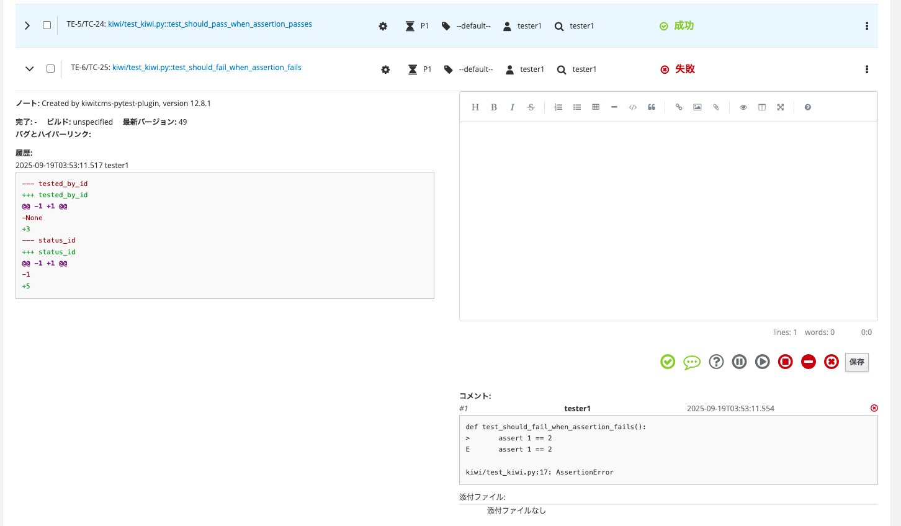

## Kiwi

以下を設定すること

**~/.tcms.conf**

```
[tcms]
url = https://localhost/xml-rpc/ 
username = tester1
password = tester1tester1 
```

**参考：**
https://kiwitcms.org/blog/atodorov/2018/11/05/test-runner-plugin-specification/


### PyTestとの連携

実行：

```py
pipenv run pytest --kiwitcms src.test_plugin_kiwi.py
```

テスト計画とテストケースを作成してテストが実行される。 
テスト結果として、ケース名とassertionの結果しかでないのが厳しい。
(これだとテストドキュメントだけよんでも理解できない)




### JUnitレポート形式のXMLの取り込み

自己認証のsslのエラー回避のため、ラップしたスクリプトから実行している

```bash
export TCMS_PLAN_ID=1
export TCMS_PRODUCT="製品A"
export TCMS_PRODUCT_VERSION="ver1.0"
export TCMS_BUILD="unspecified"
pipenv run python -m src.tcms_junit_plugin ./demo_report.xml
```

### 直接操作の例

kiwitcms-pytest-pluginでやっているようなことを自前でやる。

```py
pipenv run python -m src.sample 
```
